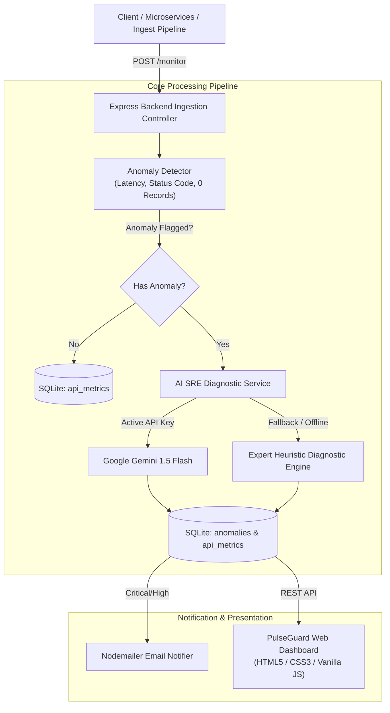

# 🛡️ Intelligent API Monitoring & Alert System (PulseGuard AI)

A robust, production-ready API observability and anomaly detection backend built with **Node.js (Express)**, **SQLite**, and **Google Gemini AI**. PulseGuard AI ingests real-time API health telemetry, detects multi-tier operational anomalies, and automatically generates Site Reliability Engineer (SRE)-grade diagnostic alerts complete with technical root-cause analyses and actionable remediation steps.

---

## 🌟 Key Features

1. **Multi-Tier Anomaly Detection Engine**:
   - **Server Failures (5xx)**: Flags internal errors and gateway timeouts (`504 Gateway Timeout`, `502 Bad Gateway`) as `CRITICAL`.
   - **Authentication & Client Errors (4xx)**: Flags unauthorized/forbidden calls (`401/403`) and invalid requests as `HIGH`/`MEDIUM`.
   - **Latency Threshold Violations**: Configurable dual-tier thresholds (`Warning: >1500ms`, `Critical: >4000ms`).
   - **Silent Data Drops (Zero-Record 200 OK)**: Detects operational data loss when endpoints respond with `200 OK` but deliver `0 records`.

2. **AI-Powered Diagnostics & Fallback Reliability**:
   - Powered by **Google Gemini 1.5 Flash** with a structured on-call SRE prompt.
   - Generates three clear deliverables per incident:
     - `ai_alert`: Urgent, human-readable notification for Slack / PagerDuty.
     - `ai_analysis`: Technical root cause diagnosis (e.g., connection pool exhaustion, schema drift).
     - `suggested_action`: Actionable, prioritized steps for on-call teams.
   - **Deterministic Offline Heuristic Fallback**: Evaluates deterministically with expert precision if no API key is provided or during network outages.

3. **High-Performance Persistence & Architecture**:
   - Zero-configuration **SQLite** database (`better-sqlite3` with WAL mode enabled).
   - Ingestion throughput supporting single-event telemetry and bulk batch arrays.

4. **Modern Interactive Dashboard**:
   - Dark-mode responsive UI with KPI summary cards and health breakdown per endpoint.
   - Real-time alert feed with severity tags, AI analysis blocks, and one-click incident resolution.
   - Built-in **Telemetry Simulator Console** with quick presets (500 Crash, 504 Timeout, 0-Record Drop, Latency Spikes).

5. **Bonus Features**:
   - **Batch Processor CLI**: `npm run batch` evaluates telemetry arrays and generates a terminal summary report.
   - **Automated Email Dispatch**: Nodemailer integration to notify engineers on `CRITICAL` or `HIGH` anomalies.

---

## 🏗️ Architecture Diagram



---

## 🚀 Quick Start Guide

### Prerequisites
- **Node.js**: v18.0.0 or higher (Tested on Node v20 & v26)
- **npm**: v9.0.0 or higher

### 1. Clone the Repository
```bash
git clone https://github.com/zahidoverflow/intelligent-api-monitor.git
cd intelligent-api-monitor
```

### 2. Install Dependencies
```bash
npm install
```

### 3. Configure Environment Variables
Copy `.env.example` to `.env`:
```bash
cp .env.example .env
```
*(Optional: Add your `GEMINI_API_KEY` to `.env` for live LLM inference. If omitted, the system seamlessly runs on the deterministic heuristic engine.)*

### 4. Start the Application
```bash
npm start
```
- 🌐 **Dashboard UI**: [http://localhost:4000](http://localhost:4000)
- 📡 **Health Check**: [http://localhost:4000/health](http://localhost:4000/health)

---

## 🧪 Testing & Batch Evaluation

### Run Automated Unit & Integration Tests
```bash
npm test
```
*Executes tests covering healthy metrics, 5xx server crashes, 504 timeouts, 401 auth failures, dual latency thresholds, zero-record anomalies, and database persistence.*

### Run Batch Processing CLI
```bash
npm run batch
```
*Evaluates `data/sample_api_responses.json` and outputs a formatted terminal report.*

---

## 📖 REST API Documentation

### 1. Ingest Telemetry (`POST /monitor`)
Accepts either a single JSON metric or an array of metrics.

**Request:**
```bash
curl -X POST http://localhost:4000/monitor \
  -H "Content-Type: application/json" \
  -d '{
    "api_name": "AppointmentAPI",
    "status_code": 500,
    "response_time_ms": 5500,
    "records_returned": 0
  }'
```

**Response:**
```json
{
  "success": true,
  "message": "Anomaly detected and recorded for AppointmentAPI.",
  "data": {
    "metric_id": 16,
    "api_name": "AppointmentAPI",
    "has_anomaly": true,
    "anomalies": [
      {
        "id": 16,
        "anomaly_type": "SERVER_ERROR",
        "severity": "CRITICAL",
        "description": "AppointmentAPI returned server error HTTP 500 with 0 records returned.",
        "ai_alert": "AppointmentAPI failed with status 500 and returned 0 records.",
        "ai_analysis": "Internal server failure on AppointmentAPI. Possible unhandled exception or DB pool exhaustion.",
        "suggested_action": "Inspect application error logs and restart failing replicas.",
        "status": "active"
      }
    ]
  }
}
```

### 2. Fetch Incidents & Alerts (`GET /alerts`)
Supports filtering by `status`, `severity`, and pagination:
```bash
curl "http://localhost:4000/alerts?status=active&severity=CRITICAL&limit=10"
```

### 3. Resolve Incident (`PATCH /alerts/:id/resolve`)
```bash
curl -X PATCH http://localhost:4000/alerts/16/resolve
```

### 4. Telemetry Metrics Summary (`GET /metrics/summary`)
```bash
curl http://localhost:4000/metrics/summary
```

---

## 📁 Repository Structure

```
├── AI_Prompts.docx                 # Formal prompt documentation (Word format)
├── AI_Prompts.md                   # Formal prompt documentation (Markdown format)
├── video_walkthrough_script.md     # 5-minute video explanation script
├── data/
│   └── sample_api_responses.json   # Specification-compliant test dataset
├── public/
│   ├── css/style.css               # Modern dark-mode styling
│   ├── js/app.js                   # Dashboard state, polling & simulator logic
│   └── index.html                  # Interactive dashboard UI
├── scripts/
│   ├── generate_ai_prompts_doc.js  # Generator for AI_Prompts.docx
│   └── run_batch.js                # CLI batch processing utility
├── src/
│   ├── app.js                      # Express application setup
│   ├── config/config.js            # Configuration & thresholds
│   ├── db/database.js              # SQLite schema & query helpers
│   ├── routes/
│   │   ├── alertRoutes.js          # /alerts endpoints
│   │   ├── metricRoutes.js         # /metrics endpoints
│   │   └── monitorRoutes.js        # /monitor ingestion endpoints
│   └── services/
│       ├── aiAlertService.js       # Google Gemini LLM & heuristic fallback
│       ├── anomalyDetector.js      # Multi-tier anomaly rule evaluation
│       ├── batchProcessor.js       # Core batch & event processor
│       └── emailNotifier.js        # Nodemailer alert dispatch service
├── tests/
│   └── anomaly.test.js             # Automated test suite
├── package.json
└── server.js                       # Server entry point
```

---

## 📄 License & Author

- **Author**: Zahidul Islam ([@zahidoverflow](https://github.com/zahidoverflow))
- **Email**: [zahidul.islam.dev@gmail.com](mailto:zahidul.islam.dev@gmail.com)
- **License**: MIT
